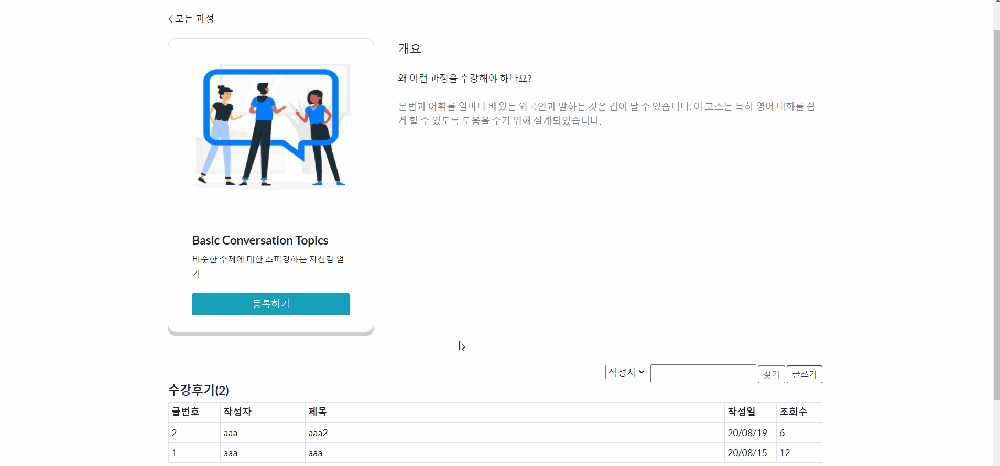

# JSP Project
## English learning website
> This is my first JSP website Project. I made my project by referring to cambly website. (cambly.com) All the website design sources come from free bootstrap site. (https://startbootstrap.com/themes/landing-page/) (https://colorlib.com/wp/templates/) And I downloaded images from freepik.com. Thank you.
+ Environment: JSP, HTML5, Bootstrap4, Oracle SQL Developer, Tomcat 9.0
***
+ Website main page, Introducing page

***
+ Viewing learing courses, select one of them and review board of it. Click "write" button to make a review but get a "Sign in first." message. 

***
+ ry to login, but there are no such id in DB. So have to sign up. Then users can see their account and cart.

***
+ Now users can add reviews. The user id is automatically held in. Users also can edit or delete their reviews and comments.

***
+ Editing review and delete comments, review.

***
+ After logout, edit and delete buttons are dissappeared.

***
+ Admin user and upload course information. Then all website users can see that in course tab. also admin user can edit that course or delete it. 

